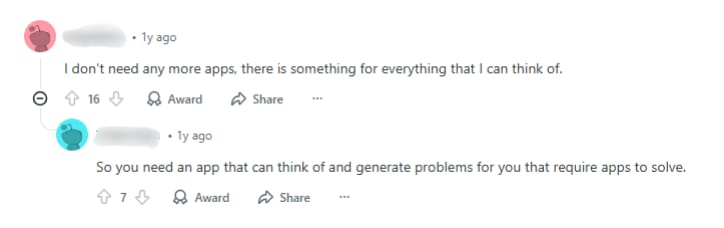

# ProMine

Mine real problems worth solving.

ProMine is a local-first app that helps you capture everyday friction (the small annoying stuff you usually forget), find patterns over time, and turn them into clear problem statements with optional solution ideas you can actually build.

## How this started

This project started from a random Reddit moment. I came across a funny comment thread about tool ideas people might want to build to solve problems in their lives, and it sparked this idea.

It was meant to be funny, but it also had a real point hidden inside it.

People do not struggle to build solutions. They struggle to notice and define the right problems.

That is what ProMine is trying to solve.

## The problem

Most good product ideas do not come from brainstorming. They come from:

- repeating the same annoying thing again and again
- wasting time on something avoidable
- thinking "why does this still not have a simple solution?"

But the problem is that we forget those moments quickly.

So when we want to build something, we end up:

- copying existing ideas
- building random clones
- solving problems that are not real pain points

ProMine exists to make sure the best problems do not get lost.

## What ProMine does

ProMine is built around a simple cycle.

### 1. Capture friction
Whenever something annoys you, wastes time, or breaks your flow, you log it in one line.

Examples:
- "I kept switching apps and lost focus."
- "I searched the same thing again."
- "I copy-pasted the same config 5 times."

### 2. Detect patterns
Over time, ProMine groups similar friction moments and detects recurring themes.

So instead of a random list of complaints, you get:
- repeated pain points
- trends
- what keeps happening again and again

### 3. Convert it into problem statements
ProMine generates structured problem statements that are actually buildable.

Example output:
"You frequently waste time recreating the same setup across projects."

### 4. Suggest ideas (optional)
Once the problem is clear, ProMine can suggest solution directions like:
- browser extension
- automation script
- template or checklist
- mobile tool
- CLI helper

This way, the ideas are not random. They are grounded in something real.

## Draft architecture

ProMine follows an offline-first pipeline. Everything happens on-device, and no data leaves the phone.

## Why this is different

ProMine is not:
- a to-do app
- a habit tracker
- a journaling app
- a random startup idea generator

It is more like a problem-mining assistant.

Instead of generating ideas out of thin air, it helps you notice real friction, track it consistently, extract patterns, and build from real problems.

## Can't AI do this already?

You can ask an AI for ideas, but AI usually gives generic answers because it does not know:
- what you experience daily
- what annoys you repeatedly
- what wastes your time most often

ProMine solves the missing part.

AI can generate ideas. ProMine helps you collect real problems first.

The app turns your daily friction into a personal dataset and then extracts meaningful problems from it.

## Privacy

ProMine is designed to be local-first.

Your friction logs are personal, so the goal is simple:
- no accounts by default
- no server required
- everything stays on your device
- works offline

## What I am building next

Planned features:
- fast friction logging
- weekly problem report (like Spotify Wrapped)
- pattern clustering and ranking
- export and shareable report cards
- optional insight improvements

## License

This project is open source and available under the GNU GPLv3 License.
See the [LICENSE](./LICENSE) file for details.

## Note

This README might change during progress, so older versions will be moved to a folder. The README might also change due to my overloading thoughts lol 😂. Soon it will be updated with the MVP.
